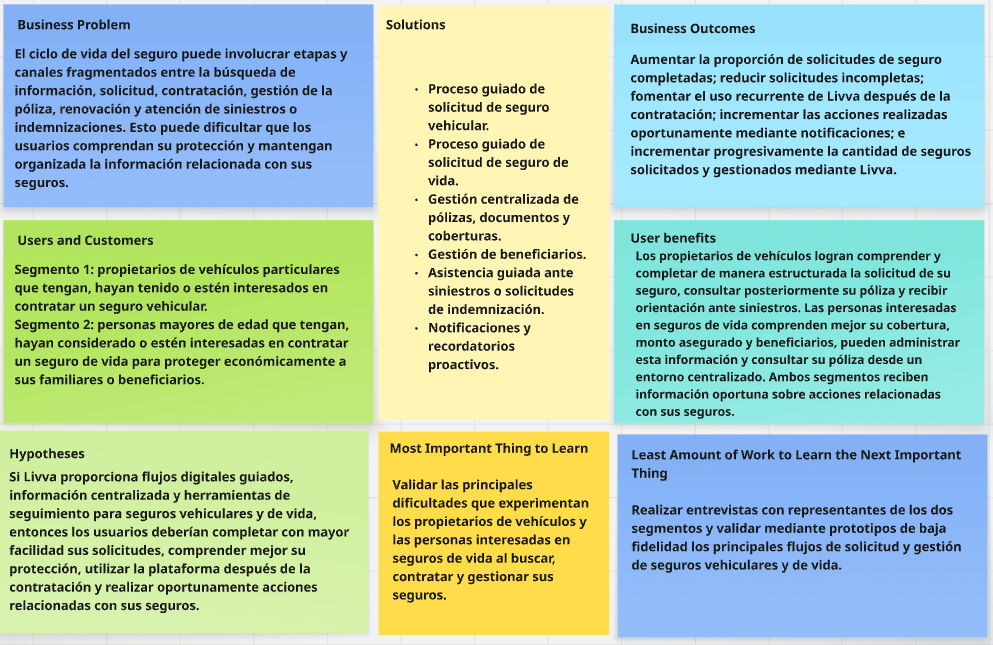

# Livva

  

  
Universidad Peruana de Ciencias Aplicadas

  
Facultad de Ingeniería

  
Carrera de Ingeniería de Software

  
Ciclo académico 2026-20
 

  
<b>1ASI0730</b>

  
<b>Aplicaciones Web</b>

  
NRC

  
<b>8168</b>

  
<b>Informe de Trabajo Final</b>

  
Docente

  
<b>Sánchez Ponce, Alex Humberto</b>

  
Startup

  
<b>Livva Care</b>
 
  
Producto

  
<b>Livva</b>

  <h3>Integrantes</h3>

  <table>
    <thead>
      <tr>
        <th>Código</th>
        <th>Apellidos y Nombres</th>
      </tr>
    </thead>
    <tbody>
      <tr>
        <td>U202321613</td>
        <td>Paredes Chavez, Carlos Augusto</td>
      </tr>
      <tr>
        <td>U202323369</td>
        <td>Torres Diaz, Rolando Andre</td>
      </tr>
      <tr>
        <td>U202418623</td>
        <td>Contreras Panuera, Fernando Fabrizio</td>
      </tr>
	<tr>
        <td>U202416147</td>
        <td>Cespedes Lezcano, Carlos Gabriel</td>
      </tr>
	<tr>
        <td>U20241f577</td>
        <td>Rivera Aguilar, Scarlet Josefina</td>
      </tr>
    </tbody>
  </table>
   

  
<b>Septiembre, 2026</b>

## Registro de Versiones del Informe

| Versión | Fecha |  Autor   |                                                  Descripción de modificación                                                   |
| :-----: |:-----:|:--------:| :----------------------------------------------------------------------------------------------------------------------------: |
|   AV1   |       |  Todos   | Se agregó la primera versión del informe, incluyendo carátula, registro de versiones, perfiles del equipo, análisis inicial del problema, artefactos de UX, arquitectura preliminar y evidencias del Sprint 1. |

## Project Report Collaboration Insights

A continuación, se presenta el repositorio utilizado para la elaboración colaborativa del informe del proyecto Livva.

#### Link del repositorio del Reporte:

- https://github.com/upc-pre-202620-1asi0730-8168-livva-care/livva-project-report

### Entrega AV1:

#### Participación por integrante:

##### Commits en el Project Report:

# Contenido

## Índice

- [Registro de Versiones del Informe](#registro-de-versiones-del-informe)
- [Project Report Collaboration Insights](#project-report-collaboration-insights)
- [Contenido](#contenido)
- [Student Outcome](#student-outcome)
- [Capítulo I: Introducción](#capítulo-i-introducción)
    - [1.1. Startup Profile](#11-startup-profile)
        - [1.1.1. Descripción de la Startup](#111-descripción-de-la-startup)
        - [1.1.2. Perfiles de integrantes del equipo](#112-perfiles-de-integrantes-del-equipo)
    - [1.2. Solution Profile](#12-solution-profile)
        - [1.2.1. Antecedentes y problemática](#121-antecedentes-y-problemática)
        - [1.2.2. Lean UX Process](#122-lean-ux-process)
            - [1.2.2.1. Lean UX Problem Statements](#1221-lean-ux-problem-statements)
            - [1.2.2.2. Lean UX Assumptions](#1222-lean-ux-assumptions)
            - [1.2.2.3. Lean UX Hypothesis Statements](#1223-lean-ux-hypothesis-statements)
            - [1.2.2.4. Lean UX Canvas](#1224-lean-ux-canvas)
    - [1.3. Segmentos objetivo](#13-segmentos-objetivo)
- [Capítulo II: Requirements Elicitation & Analysis](#capítulo-ii-requirements-elicitation--analysis)
    - [2.1. Competidores](#21-competidores)
        - [2.1.1. Análisis competitivo](#211-análisis-competitivo)
        - [ Estrategias y tácticas frente a competidores](#212-estrategias-y-tácticas-frente-a-competidores)
    - [2.2. Entrevistas](#22-entrevistas)
        - [2.2.1. Diseño de entrevistas](#221-diseño-de-entrevistas)
        - [2.2.2. Registro de entrevistas](#222-registro-de-entrevistas)
        - [2.2.3. Análisis de entrevistas](#223-análisis-de-entrevistas)
    - [2.3. Needfinding](#23-needfinding)
        - [2.3.1. User Personas](#231-user-personas)
        - [2.3.2. User Task Matrix](#232-user-task-matrix)
        - [2.3.3. User Journey Mapping](#233-user-journey-mapping)
        - [2.3.4. Empathy Mapping](#234-empathy-mapping)
    - [2.4. Big Picture Event Storming](#24-big-picture-event-storming)
    - [2.5. Ubiquitous Language](#25-ubiquitous-language)
- [Capítulo III: Requirements Specification](#capítulo-iii-requirements-specification)
    - [3.1. User Stories](#31-user-stories)
    - [3.2. Impact Mapping](#32-impact-mapping)
    - [3.3. Product Backlog](#33-product-backlog)
- [Capítulo IV: Product Design](#capítulo-iv-product-design)
    - [4.1. Style Guidelines](#41-style-guidelines)
        - [4.1.1. General Style Guidelines](#411-general-style-guidelines)
        - [4.1.2. Web Style Guidelines](#412-web-style-guidelines)
    - [4.2. Information Architecture](#42-information-architecture)
        - [4.2.1. Organization Systems](#421-organization-systems)
        - [4.2.2. Labeling Systems](#422-labeling-systems)
        - [4.2.3. SEO Tags and Meta Tags](#423-seo-tags-and-meta-tags)
        - [4.2.4. Searching Systems](#424-searching-systems)
        - [4.2.5. Navigation Systems](#425-navigation-systems)
    - [4.3. Landing Page UI Design](#43-landing-page-ui-design)
        - [4.3.1. Landing Page Wireframe](#431-landing-page-wireframe)
        - [4.3.2. Landing Page Mock-up](#432-landing-page-mock-up)
    - [4.4. Web Applications UX/UI Design](#44-web-applications-uxui-design)
        - [4.4.1. Web Applications Wireframes](#441-web-applications-wireframes)
        - [4.4.2. Web Applications Wireflow Diagrams](#442-web-applications-wireflow-diagrams)
        - [4.4.3. Web Applications Mock-ups](#443-web-applications-mock-ups)
        - [4.4.4. Web Applications User Flow Diagrams](#444-web-applications-user-flow-diagrams)
    - [4.5. Web Applications Prototyping](#45-web-applications-prototyping)
    - [4.6. Domain-Driven Software Architecture](#46-domain-driven-software-architecture)
        - [4.6.1. Design-Level Event Storming](#461-design-level-event-storming)
        - [4.6.2. Software Architecture Context Diagram](#462-software-architecture-context-diagram)
        - [4.6.3. Software Architecture Container Diagrams](#463-software-architecture-container-diagrams)
        - [4.6.4. Software Architecture Components Diagrams](#464-software-architecture-components-diagrams)
    - [4.7. Software Object-Oriented Design](#47-software-object-oriented-design)
        - [4.7.1. Class Diagrams](#471-class-diagrams)
    - [4.8. Database Design](#48-database-design)
        - [4.8.1. Database Diagrams](#481-database-diagrams)
- [Capítulo V: Product Implementation, Validation & Deployment](#capítulo-v-product-implementation-validation--deployment)
    - [5.1. Software Configuration Management](#51-software-configuration-management)
        - [5.1.1. Software Development Environment Configuration](#511-software-development-environment-configuration)
        - [5.1.2. Source Code Management](#512-source-code-management)
        - [5.1.3. Source Code Style Guide & Conventions](#513-source-code-style-guide--conventions)
        - [5.1.4. Software Deployment Configuration](#514-software-deployment-configuration)
    - [5.2. Landing Page, Services & Applications Implementation](#52-landing-page-services--applications-implementation)
        - [5.2.1. Sprint 1](#521-sprint-1)
            - [5.2.1.1. Sprint Planning 1](#5211-sprint-planning-1)
            - [5. Aspect Leaders and Collaborators](#5212-aspect-leaders-and-collaborators)
            - [5.2.1.3. Sprint Backlog 1](#5213-sprint-backlog-1)
            - [5.2.1.4. Development Evidence for Sprint Review](#5214-development-evidence-for-sprint-review)
            - [5.2.1.5. Execution Evidence for Sprint Review](#5215-execution-evidence-for-sprint-review)
            - [5.2.1.6. Services Documentation Evidence for Sprint Review](#5216-services-documentation-evidence-for-sprint-review)
            - [5.2.1.7. Software Deployment Evidence for Sprint Review](#5217-software-deployment-evidence-for-sprint-review)
            - [5.2.1.8. Team Collaboration Insights during Sprint](#5218-team-collaboration-insights-during-sprint)
- [Conclusiones](#conclusiones)
    - [Conclusiones y recomendaciones](#conclusiones-y-recomendaciones)
- [Bibliografía](#bibliografía)
- [Anexos](#anexos)

## Student Outcome

El curso contribuye al cumplimiento del siguiente Student Outcome ABET:

**ABET – EAC – Student Outcome 5**

**Criterio:** La capacidad de funcionar efectivamente en un equipo cuyos miembros juntos proporcionan liderazgo, crean un entorno de colaboración e inclusivo, establecen objetivos, planifican tareas y cumplen objetivos.

En el siguiente cuadro se describen las acciones realizadas por los integrantes del equipo y las conclusiones obtenidas durante el desarrollo del proyecto Livva, con el propósito de evidenciar el cumplimiento del ABET – EAC – Student Outcome 5.

| Criterio específico | Acciones realizadas | Conclusiones |
|---|---|---|
| **Trabaja en equipo para proporcionar liderazgo en forma conjunta.** | **Paredes Chavez, Carlos Augusto** **AV1:**  **Torres Diaz, Rolando Andre** **AV1:**  **Contreras Panuera, Fernando Fabrizio** **AV1:**  **Céspedes Lezcano, Carlos Gabriel** **AV1:**  **Rivera Aguilar, Scarlet Josefina** **AV1:** | **AV1:** |
| **Crea un entorno colaborativo e inclusivo, establece metas, planifica tareas y cumple objetivos.** | **Paredes Chavez, Carlos Augusto** **AV1:**  **Torres Diaz, Rolando Andre** **AV1:**  **Contreras Panuera, Fernando Fabrizio** **AV1:**  **Céspedes Lezcano, Carlos Gabriel** **AV1:**  **Rivera Aguilar, Scarlet Josefina** **AV1:** | **AV1:** |

# Capítulo I: Introducción

## 1.1. Startup Profile

### 1.1.1. Descripción de la Startup

**Livva Care** es una startup peruana orientada al desarrollo de soluciones digitales para facilitar el acceso, intermediación y gestión de seguros mediante experiencias web simples, centralizadas y orientadas al usuario.

Su producto principal, **Livva**, busca conectar digitalmente a los usuarios con productos de compañías aseguradoras asociadas, concentrándose inicialmente en seguros vehiculares y seguros de vida.

La propuesta de Livva Care no consiste en asumir las funciones propias de una compañía aseguradora. Las compañías asociadas mantienen responsabilidades como la evaluación del riesgo, determinación de condiciones, emisión de pólizas y resolución final de siniestros o solicitudes de indemnización. Livva se concentra en proporcionar una experiencia digital para facilitar la búsqueda de información, solicitud, consulta y gestión posterior de los seguros.

El modelo de negocio contempla ingresos derivados de la intermediación de seguros y de planes de suscripción propios de Livva, mediante los cuales los usuarios pueden acceder a beneficios adicionales de la plataforma.

Durante la primera etapa del producto, Livva Care se enfocará exclusivamente en dos segmentos: propietarios de vehículos particulares interesados en seguros vehiculares y personas interesadas en seguros de vida.

### Misión

Facilitar el acceso y la gestión de seguros mediante una experiencia digital clara, centralizada y accesible, ayudando a las personas a comprender, solicitar y administrar su protección de forma más sencilla y acompañada.

### Visión

Convertir a Livva Care en una plataforma digital referente en el Perú para la intermediación y gestión de seguros, reconocida por simplificar la relación entre las personas y sus seguros mediante una experiencia confiable, transparente y orientada a sus necesidades.

### 1.1.2. Perfiles de integrantes del equipo

|   Código   | Nombre completo del integrante  | Descripción de la carrera                                          |                               Fotografía                                | Conocimientos y habilidades                                                                                                                                                                                                                                                                                                                                                                                                                                                                                                                                                                                                                                                                                                                                                                                                                                                                                                                                                                                                             |
| :--------: |:--------------------------------| :----------------------------------------------------------------- |:-----------------------------------------------------------------------:| :-------------------------------------------------------------------------------------------------------------------------------------------------------------------------------------------------------------------------------------------------------------------------------------------------------------------------------------------------------------------------------------------------------------------------------------------------------------------------------------------------------------------------------------------------------------------------------------------------------------------------------------------------------------------------------------------------------------------------------------------------------------------------------------------------------------------------------------------------------------------------------------------------------------------------------------------------------------------------------------------------------------------------------------- |
| U202321613 | Paredes Chavez, Carlos Augusto | Ingeniería de Software - Universidad Peruana de Ciencias Aplicadas |  | Soy estudiante de Ingeniería de Software y tengo experiencia en el desarrollo de aplicaciones web, principalmente utilizando HTML, CSS, JavaScript, TypeScript y frameworks modernos. También cuento con conocimientos en bases de datos, control de versiones con Git y GitHub, y desarrollo tanto frontend como backend. Me interesa especialmente crear soluciones digitales funcionales, bien estructuradas y con una buena experiencia de usuario. Me considero una persona constante, responsable y con facilidad para aprender nuevas tecnologías. Busco seguir fortaleciendo mis conocimientos mediante proyectos prácticos que me permitan mejorar mis habilidades técnicas y prepararme para desenvolverme profesionalmente en el área de desarrollo de software. |
| U202323369 | Torres Diaz, Rolando Andre | Ingeniería de Software - Universidad Peruana de Ciencias Aplicadas |  | Soy Rolando Andre Torres Diaz, estudiante de la carrera de Ingeniería de Software en la Universidad Peruana de Ciencias Aplicadas (UPC). A lo largo de la carrera he ido adquiriendo conocimientos en programación, desarrollo de software, bases de datos, diseño de aplicaciones y tecnologías web. Dentro del desarrollo de Livva participaré en distintas etapas del proyecto, como el análisis de requerimientos, el diseño de la solución, el desarrollo de funcionalidades, la gestión de la base de datos y la elaboración de la documentación. |           
| U202418623 | Contreras Panuera, Fernando Fabrizio | Ingeniería de Software - Universidad Peruana de Ciencias Aplicadas |  | Soy estudiante de Ingeniería de Software y tengo conocimientos en el desarrollo de aplicaciones web, principalmente utilizando HTML, CSS, JavaScript y C++. También cuento con conocimientos en bases de datos, control de versiones con Git y GitHub, y desarrollo tanto frontend como backend. Me interesa especialmente crear soluciones digitales funcionales, bien estructuradas y que puedan brindar una buena experiencia de usuario. Me considero una persona constante, responsable y con facilidad para aprender nuevas tecnologías. Me gusta desarrollar proyectos prácticos que me permitan poner en práctica lo aprendido y mejorar progresivamente mis habilidades. Busco seguir fortaleciendo mis conocimientos durante mi formación universitaria y adquirir nuevas experiencias que me ayuden a crecer en el área del desarrollo de software. |
| U202416147 | Céspedes Lezcano, Carlos Gabriel | Ingeniería de Software - Universidad Peruana de Ciencias Aplicadas |  | Soy estudiante de Ingeniería de Software con experiencia en el desarrollo de aplicaciones web mediante HTML, CSS y JavaScript, además del manejo de bases de datos y control de versiones con Git. Me enfoco en construir soluciones digitales funcionales, bien estructuradas y orientadas a ofrecer una gran experiencia de usuario. Destaco por mi constancia, responsabilidad y capacidad para adaptarme rápidamente a nuevas tecnologías. Busco seguir consolidando mis competencias mediante el desarrollo de proyectos prácticos que me impulsen a crecer técnicamente y prepararme para el entorno profesional del software. |
| U20241f577 | Rivera Aguilar, Scarlet Josefina | Ingeniería de Software - Universidad Peruana de Ciencias Aplicadas |  | Actualmente me encuentro en el quinto ciclo de mi carrera y tengo un gran interés por el análisis de datos. Me considero una persona organizada, constante y con una fuerte motivación por aprender. Disfruto comprender el funcionamiento de las cosas, identificar fallas y plantear soluciones de mejora. Me desempeño adecuadamente en trabajo en equipo, incluso bajo presión, y valoro compartir mis conocimientos con los demás. |

## 1.2. Solution Profile

La solución propuesta por Livva consiste en una plataforma web orientada a facilitar la intermediación y gestión digital de seguros vehiculares y de vida.

La experiencia busca acompañar al usuario durante diferentes etapas del ciclo del seguro, desde la búsqueda de información y solicitud inicial hasta la consulta y administración posterior de la póliza, incluyendo documentos, coberturas, beneficiarios, renovaciones y procesos relacionados con siniestros o solicitudes de indemnización.

Livva se plantea como un bróker digital que facilita la interacción entre los usuarios y las compañías aseguradoras asociadas. Las aseguradoras mantienen responsabilidades como la evaluación correspondiente, definición de las condiciones del producto, emisión de pólizas y resolución de solicitudes de cobertura o indemnización, mientras que Livva concentra la experiencia digital de intermediación y acompañamiento.

Como parte de su modelo de negocio, Livva ofrecerá planes de suscripción dirigidos a sus usuarios. Estos planes permitirán diferenciar el nivel de beneficios y servicios digitales disponibles dentro de la plataforma, manteniendo un alcance simplificado y viable para la primera versión del producto.

La solución está dirigida inicialmente a dos segmentos objetivo: propietarios de vehículos particulares interesados en seguros vehiculares y personas interesadas en contratar o gestionar seguros de vida.

Las compañías aseguradoras participan como organizaciones externas asociadas al ecosistema de Livva, pero no constituyen un segmento objetivo ni dispondrán de una aplicación empresarial propia dentro del alcance inicial del proyecto.

### 1.2.1. Antecedentes y Problemática

La contratación y posterior gestión de un seguro puede involucrar distintas etapas, documentos, conceptos y canales de comunicación.

En el caso de los seguros vehiculares, una persona debe buscar información, proporcionar datos sobre su vehículo, comprender las coberturas disponibles, revisar las condiciones de la póliza y conocer qué debe realizar ante un eventual accidente o siniestro.

En los seguros de vida, el usuario debe comprender conceptos relacionados con la cobertura, el monto asegurado y los beneficiarios, además de mantener disponible la información de su póliza y conocer los procedimientos relacionados con una eventual solicitud de indemnización.

Estas actividades pueden encontrarse distribuidas entre páginas web, documentos, correos electrónicos, llamadas telefónicas y otros canales de atención, dificultando que el usuario mantenga una visión clara y continua de la protección contratada.

Livva propone abordar esta situación mediante una plataforma que centralice digitalmente las principales actividades correspondientes a la solicitud y posterior gestión de seguros vehiculares y de vida.

#### Análisis preliminar mediante 5W2H

##### What?
**¿Qué sucede?**

- La búsqueda, contratación y administración de seguros puede involucrar información, documentos y actividades distribuidos entre distintas etapas y canales, dificultando que los usuarios comprendan y gestionen de manera continua su protección.

##### When
**¿Cuándo ocurre?**

- Durante diferentes momentos del ciclo de vida del seguro, como la búsqueda de información, cotización, solicitud, contratación, emisión, vigencia, renovación y atención de un siniestro o solicitud de indemnización.

##### Where
**¿Dónde ocurre?**

- Inicialmente, el proyecto se plantea para el mercado peruano y para interacciones realizadas mediante canales digitales entre los usuarios, Livva y las compañías aseguradoras asociadas. La experiencia principal se desarrollará mediante un Landing Page y una Web Application responsive integrados con los servicios de Livva.

##### Who
**¿Quiénes están involucrados?**

- Propietarios de vehículos particulares que tengan, hayan tenido o estén interesados en contratar un seguro vehicular.
- Personas mayores de edad que tengan, hayan considerado o estén interesadas en contratar un seguro de vida para proteger económicamente a sus familiares o beneficiarios.

Las compañías aseguradoras participan como entidades asociadas dentro del proceso de intermediación, pero no constituyen un segmento objetivo de la presente investigación.

##### Why
**¿Por qué es relevante?**

- Porque la utilidad de un seguro no termina después de su contratación. Los usuarios necesitan comprender sus coberturas, consultar la información de sus pólizas, mantener determinados datos actualizados y conocer qué acciones realizar ante una renovación, siniestro o solicitud de indemnización.

##### How?
**¿Cómo se aborda el problema actualmente?**

- Los usuarios recurren a compañías aseguradoras, corredores, páginas web y distintos canales comerciales o de atención para buscar, contratar y posteriormente administrar sus seguros. Livva propone centralizar digitalmente las principales etapas correspondientes a la intermediación y acompañamiento dentro de una experiencia web, ofreciendo adicionalmente planes de servicio propios que permitan acceder a distintos beneficios dentro de la plataforma.

##### How Much
**¿Cuál es el impacto?**

- El impacto depende de factores como el tipo de seguro, la cobertura contratada, los canales utilizados y la experiencia particular de cada usuario. Durante las entrevistas se buscará identificar el nivel de tiempo, esfuerzo, dificultad y comprensión percibido por los dos segmentos objetivo en los procesos actuales, evitando establecer cifras sin evidencia.

A partir del análisis preliminar, se identifica como principal oportunidad la creación de una experiencia digital que mantenga continuidad desde la búsqueda y solicitud de un seguro hasta su gestión posterior.

Livva administrará la experiencia de intermediación, organización de información y acompañamiento digital, mientras que la compañía aseguradora asociada conservará responsabilidades como la evaluación correspondiente, emisión de la póliza y resolución final de las solicitudes de cobertura o indemnización.

**Problema central:** las actividades relacionadas con la búsqueda, solicitud, contratación y posterior gestión de seguros vehiculares y de vida pueden encontrarse distribuidas entre diferentes procesos y canales, dificultando que los usuarios comprendan y administren su protección mediante una experiencia continua y centralizada.

### Objetivos

#### Objetivo General

Diseñar, desarrollar y desplegar una plataforma web de intermediación y gestión digital de seguros vehiculares y de vida que permita a los usuarios acceder a información, realizar solicitudes, consultar y administrar sus pólizas y dar seguimiento a procesos posteriores relacionados con su protección, mediante una experiencia clara, centralizada, accesible y adaptable a distintos dispositivos.

#### Objetivos Específicos

- **Facilitar la solicitud de seguros:** proporcionar flujos digitales diferenciados para seguros vehiculares y seguros de vida, permitiendo que los usuarios registren la información necesaria de forma clara y estructurada.

- **Centralizar la gestión de pólizas:** permitir que los usuarios consulten desde un mismo entorno información relevante como vigencia, coberturas, documentos y estado de sus seguros.

- **Apoyar la gestión de seguros vehiculares:** permitir el registro y consulta de vehículos asociados al usuario, así como el inicio y seguimiento básico de solicitudes relacionadas con seguros vehiculares.

- **Apoyar la gestión de seguros de vida:** permitir la solicitud de seguros de vida y la administración de información relacionada con beneficiarios.

- **Facilitar el seguimiento posterior a la contratación:** brindar mecanismos para registrar y consultar el estado de siniestros vehiculares y solicitudes de indemnización relacionadas con seguros de vida.

- **Mantener informado al usuario:** proporcionar notificaciones relacionadas con eventos relevantes como cambios de estado, renovación de pólizas, información pendiente o avances en procesos registrados.

- **Incorporar un modelo de suscripción:** ofrecer planes de Livva con beneficios diferenciados, permitiendo al usuario consultar, contratar, revisar y cancelar su suscripción mediante un flujo simplificado.

- **Integrar servicios externos:** utilizar al menos un servicio externo de terceros como parte de los procesos de la plataforma, priorizando una integración asociada al flujo de suscripción o pago en un entorno de prueba.

- **Garantizar una experiencia web consistente:** mantener coherencia entre el Landing Page y la Web Application, incluyendo diseño responsive, accesibilidad e internacionalización según los requisitos establecidos para el proyecto.

### Restricciones

#### Restricciones de Alcance

- **Segmentos objetivo:** la primera versión de Livva estará dirigida únicamente a propietarios de vehículos particulares y personas interesadas en seguros de vida.

- **Participación de compañías aseguradoras:** las aseguradoras serán consideradas entidades externas asociadas al ecosistema de Livva. No se desarrollará un portal B2B ni funcionalidades destinadas a empleados de compañías aseguradoras dentro del alcance inicial.

- **Intermediación y no aseguramiento:** Livva actuará como una plataforma de intermediación y acompañamiento digital. No asumirá funciones propias de una compañía aseguradora como evaluación actuarial, determinación real de primas, emisión legal de pólizas o resolución definitiva de siniestros e indemnizaciones.

- **Cotizaciones y productos:** las alternativas de seguros mostradas en el sistema serán representaciones académicas o datos previamente registrados. No se implementará un motor actuarial real para calcular primas.

- **Gestión de siniestros e indemnizaciones:** la primera versión permitirá registrar información y consultar estados básicos, pero no incluirá peritajes, evaluación automatizada de daños, liquidación de indemnizaciones ni pagos reales.

- **Suscripciones:** la gestión de suscripciones se limitará a consultar planes, seleccionar un plan, activar una suscripción, consultar su estado y cancelarla. No se implementarán procesos avanzados de facturación, impuestos, devoluciones, cupones o prorrateos.

- **Pagos:** cualquier integración de pago se realizará mediante un entorno de prueba o sandbox y tendrá fines exclusivamente académicos.

- **Servicios externos:** la solución dependerá de al menos un servicio externo de terceros para cubrir un proceso específico del sistema. La indisponibilidad de dicho servicio podrá limitar temporalmente la funcionalidad asociada.

#### Restricciones Técnicas

- La solución estará compuesta por un **Landing Page**, una **Web Application responsive** y un **RESTful API** desarrollado internamente.

- La Web Application deberá consumir el RESTful API propio para acceder a las principales capacidades del negocio.

- El backend deberá desarrollarse utilizando **ASP.NET Core y C#**, con persistencia mediante **Entity Framework Core** y una base de datos relacional compatible con el alcance del proyecto.

- La experiencia deberá contemplar internacionalización para **English (en_US)** y **Latin American Spanish (es_419)**, manteniendo inglés como idioma predeterminado según las especificaciones del curso.

- El Landing Page y la Web Application deberán considerar principios de accesibilidad, incluyendo atributos ARIA y diseño adaptable a diferentes tamaños de pantalla.

#### Restricciones de Tiempo

- El desarrollo del producto estará limitado al calendario académico del curso.

- El alcance funcional principal deberá poder diseñarse, implementarse, probarse y desplegarse en aproximadamente **12 semanas**, priorizando funcionalidades esenciales sobre procesos empresariales avanzados.

- Las funcionalidades deberán organizarse progresivamente entre los diferentes Sprints y entregables del curso, manteniendo coherencia entre el Product Backlog y los objetivos de cada Sprint.

#### Restricciones de Complejidad

- Se priorizará un MVP funcional y demostrable sobre la implementación completa de procesos reales del sector asegurador.

- No se incluirán en la primera versión funcionalidades como inteligencia artificial para recomendar seguros, firma digital, OCR, validación con RENIEC o SUNARP, aplicaciones móviles nativas, geolocalización de accidentes o integración directa con sistemas internos de aseguradoras.

### 1.2.2. Lean UX Process

Para Livva se aplica el Lean UX Process con el propósito de establecer explícitamente las principales creencias relacionadas con el problema, los segmentos objetivo, los resultados esperados y las características propuestas antes de asumirlas como hechos comprobados.

Estas creencias serán posteriormente contrastadas mediante las entrevistas realizadas a propietarios de vehículos particulares y personas interesadas en seguros de vida, así como mediante las posteriores actividades de validación del producto.

El proceso considera Business Assumptions, Business Outcome Assumptions, User Assumptions, User Outcome and Benefit Assumptions y Feature Assumptions. A partir de los Feature Assumptions se establecen los respectivos Lean UX Hypothesis Statements.

#### 1.2.2.1. Lean UX Problem Statements

La situación actual de la intermediación digital de seguros se ha centrado principalmente en personas que buscan seguros vehiculares o de vida mediante procesos que pueden involucrar distintas etapas, canales de comunicación, documentos e interacciones para completar la contratación y gestionar posteriormente su póliza.

Lo que los productos y servicios existentes no siempre logran abordar de manera integral es una experiencia digital continua que facilite tanto la comprensión y solicitud del seguro como la administración posterior de la información relacionada con la póliza, coberturas, beneficiarios, renovaciones y siniestros.

Livva abordará esta oportunidad mediante una plataforma digital de corretaje de seguros que proporcione flujos especializados para seguros vehiculares y de vida, centralice la información relacionada con las pólizas y acompañe digitalmente al usuario durante diferentes etapas del ciclo de vida del seguro. La plataforma podrá ofrecer distintos niveles de beneficios mediante planes de suscripción propios de Livva.

Nuestro enfoque inicial se centrará en propietarios de vehículos particulares que tengan, hayan tenido o estén interesados en contratar un seguro vehicular y en personas mayores de edad que tengan, hayan considerado o estén interesadas en contratar un seguro de vida para proteger económicamente a sus familiares o beneficiarios.

Sabremos que hemos tenido éxito cuando observemos que los usuarios completan los procesos digitales de solicitud mediante Livva, utilizan posteriormente la plataforma para consultar y gestionar información relacionada con sus seguros, realizan oportunamente acciones vinculadas con sus pólizas y una proporción de usuarios encuentra suficiente valor en los beneficios adicionales como para utilizar un plan de suscripción de Livva.

#### 1.2.2.2. Lean UX Assumptions

##### Business Assumptions

**BA01.** Creemos que existe una oportunidad de crear valor digitalizando no solamente la solicitud inicial de un seguro, sino también diferentes actividades relacionadas con la gestión posterior de la póliza.

**BA02.** Consideramos que los seguros vehiculares y de vida poseen características suficientemente diferentes como para requerir flujos especializados, aunque pueden compartir funcionalidades como gestión de pólizas, documentación, notificaciones y asistencia relacionada con siniestros o indemnizaciones.

**BA03.** Creemos que los usuarios valorarán una experiencia que centralice información actualmente consultada mediante diferentes documentos o canales.

**BA04.** Creemos que el acompañamiento digital posterior a la contratación puede diferenciar a Livva de experiencias concentradas principalmente en la búsqueda o cotización inicial del seguro.

**BA05.** Creemos que Livva puede desarrollar un modelo de negocio sostenible combinando ingresos derivados de la intermediación de seguros contratados mediante la plataforma con ingresos recurrentes provenientes de planes de suscripción dirigidos a sus usuarios.

**BA06.** Creemos que comenzar con seguros vehiculares y de vida permitirá validar la propuesta de valor antes de incorporar nuevas categorías de seguros.

**BA07.** Creemos que determinados usuarios estarán dispuestos a contratar un plan de Livva si los beneficios adicionales proporcionan suficiente valor durante la contratación y gestión posterior de sus seguros.

##### Business Outcome Assumptions

**BOA01.** Creemos que el éxito de Livva se reflejará en un porcentaje creciente de usuarios que completan una solicitud de seguro después de iniciar el flujo correspondiente.

**BOA02.** Creemos que una reducción de solicitudes incompletas indicará que los procesos digitales guiados ayudan a los usuarios a proporcionar correctamente la información necesaria.

**BOA03.** Creemos que el uso recurrente de funcionalidades relacionadas con pólizas, documentos, beneficiarios, renovaciones y siniestros indicará que Livva genera valor después de la contratación inicial.

**BOA04.** Creemos que un aumento en la cantidad de usuarios que realizan oportunamente acciones relacionadas con sus pólizas indicará que las notificaciones y herramientas de seguimiento resultan útiles.

**BOA05.** Creemos que un incremento progresivo de seguros solicitados y gestionados mediante Livva contribuirá a la sostenibilidad del modelo de intermediación.

**BOA06.** Creemos que un porcentaje creciente de usuarios que seleccionan un plan de suscripción después de conocer sus beneficios indicará que la propuesta de valor adicional resulta relevante.

**BOA07.** Creemos que una proporción significativa de suscripciones que se mantienen activas durante su período correspondiente indicará que los beneficios del plan generan valor recurrente para los usuarios.

##### User Assumptions

**UA01.** Creemos que los propietarios de vehículos particulares desean comprender las coberturas y condiciones de un seguro vehicular antes de completar su contratación.

**UA02.** Creemos que los propietarios de vehículos valoran disponer de información clara sobre su póliza, documentos y coberturas desde un entorno digital centralizado.

**UA03.** Creemos que los propietarios de vehículos que experimentan un accidente o siniestro necesitan orientación clara sobre los pasos, información y documentación requeridos.

**UA04.** Creemos que las personas interesadas en seguros de vida pueden presentar dificultades para comprender conceptos como cobertura, monto asegurado y beneficiarios.

**UA05.** Creemos que los usuarios de seguros de vida valoran poder consultar y mantener actualizada la información relacionada con sus beneficiarios.

**UA06.** Creemos que los usuarios de ambos segmentos valoran recibir recordatorios sobre vencimientos, renovaciones, información pendiente u otras acciones relacionadas con sus seguros.

**UA07.** Creemos que los usuarios de ambos segmentos valoran tener sus pólizas, documentos y coberturas disponibles dentro de una misma plataforma.

**UA08.** Creemos que algunos usuarios de ambos segmentos pueden valorar beneficios adicionales relacionados con el acompañamiento, seguimiento y gestión digital de sus seguros lo suficiente como para considerar un plan de suscripción.

**UA09.** Creemos que los usuarios desean comprender claramente las diferencias entre los planes disponibles antes de decidir si un nivel de servicio adicional justifica su costo.

##### User Outcome and Benefit Assumptions

**UOBA01.** Los propietarios de vehículos desean completar la solicitud de un seguro comprendiendo claramente la información requerida, las coberturas disponibles y las características de la protección seleccionada.

**UOBA02.** Los propietarios de vehículos desean consultar fácilmente su póliza, documentos y coberturas y recibir orientación cuando ocurre un accidente o siniestro.

**UOBA03.** Las personas interesadas en seguros de vida desean comprender conceptos como cobertura, monto asegurado y beneficiarios antes de tomar una decisión de contratación.

**UOBA04.** Los usuarios de seguros de vida desean registrar, consultar y mantener actualizada la información de sus beneficiarios con facilidad.

**UOBA05.** Los usuarios de ambos segmentos desean disponer de información centralizada sobre sus seguros sin tener que reconstruir su historial mediante diferentes canales.

**UOBA06.** Los usuarios de ambos segmentos desean recibir información oportuna cuando deban realizar acciones relacionadas con la vigencia o gestión de sus seguros.

**UOBA07.** Los usuarios de ambos segmentos desean conocer de manera clara qué beneficios adicionales obtienen mediante cada plan de Livva para decidir si una suscripción se adapta a sus necesidades.

**UOBA08.** Los usuarios suscritos desean consultar fácilmente el plan contratado y el estado de su suscripción para mantener control sobre el servicio adquirido.

##### Feature Assumptions

**FA01.** Creemos que un flujo guiado para el registro del vehículo y la solicitud de seguro ayudará a los propietarios de vehículos a proporcionar correctamente la información necesaria y comprender mejor el proceso.

**FA02.** Creemos que un flujo guiado para la solicitud de seguro de vida, incluyendo información sobre cobertura, monto asegurado y beneficiarios, facilitará la comprensión y finalización del proceso.

**FA03.** Creemos que un espacio centralizado para consultar pólizas, documentos y coberturas facilitará a los usuarios la administración de sus seguros.

**FA04.** Creemos que una funcionalidad digital para consultar y actualizar beneficiarios permitirá a los usuarios de seguros de vida mantener esta información con mayor facilidad.

**FA05.** Creemos que un flujo guiado de asistencia ante siniestros o solicitudes de indemnización ayudará a los usuarios a comprender qué información, documentación y pasos son necesarios durante estos procesos.

**FA06.** Creemos que las notificaciones proactivas sobre vencimientos, renovaciones, información pendiente y cambios de estado ayudarán a los usuarios a realizar oportunamente las acciones relacionadas con sus seguros.

**FA07.** Creemos que ofrecer planes de suscripción claramente diferenciados, junto con un proceso sencillo para seleccionar, activar, consultar y cancelar una suscripción, permitirá a los usuarios acceder a niveles de servicio acordes con sus necesidades y contribuirá a generar ingresos recurrentes para Livva.

#### 1.2.2.3. Lean UX Hypothesis Statements

##### HS01 — Solicitud guiada de seguro vehicular

Creemos que lograremos una mayor tasa de finalización de solicitudes de seguro vehicular.

Si los propietarios de vehículos particulares

Obtienen una experiencia de solicitud más clara y estructurada

Con un flujo guiado para el registro del vehículo y la solicitud del seguro.

##### HS02 — Solicitud guiada de seguro de vida

Creemos que lograremos una mayor tasa de finalización de solicitudes de seguro de vida.

Si las personas interesadas en seguros de vida

Obtienen mayor claridad sobre la cobertura, el monto asegurado y la información de sus beneficiarios

Con un flujo guiado para la solicitud de seguro de vida.

##### HS03 — Gestión centralizada de pólizas

Creemos que lograremos una mayor interacción de los usuarios con Livva después de la contratación.

Si los usuarios que poseen un seguro activo

Obtienen acceso centralizado a sus pólizas, documentos y coberturas

Con un espacio digital para la gestión de sus seguros.

##### HS04 — Gestión de beneficiarios

Creemos que lograremos reducir la dificultad asociada con la consulta y actualización de información de beneficiarios.

Si los usuarios que poseen un seguro de vida

Obtienen mayor control sobre la información de sus beneficiarios

Con una funcionalidad digital para consultar y actualizar beneficiarios.

##### HS05 — Asistencia ante siniestros e indemnizaciones

Creemos que lograremos que un mayor porcentaje de solicitudes relacionadas con siniestros o indemnizaciones sea registrado con la información requerida.

Si los usuarios que necesitan iniciar uno de estos procesos

Obtienen orientación clara sobre la información, documentación y pasos necesarios

Con un flujo guiado de asistencia y seguimiento.

##### HS06 — Notificaciones proactivas

Creemos que lograremos una mayor cantidad de acciones realizadas oportunamente en relación con la gestión de los seguros.

Si los usuarios con seguros activos

Obtienen información oportuna sobre vencimientos, renovaciones, información pendiente y cambios de estado

Con notificaciones proactivas y alertas dentro de Livva.

##### HS07 — Planes de suscripción Livva

Creemos que lograremos incrementar los ingresos recurrentes generados mediante la plataforma.

Si los usuarios de seguros vehiculares y de vida

Obtienen beneficios adicionales acordes con sus necesidades y comprenden claramente las diferencias entre los niveles de servicio

Con planes de suscripción de Livva que puedan seleccionar y gestionar digitalmente.

#### 1.2.2.4. Lean UX Canvas

## 1.3. Segmentos objetivo

# Capítulo II: Requirements Elicitation & Analysis

## 2.1. Competidores
Livva Care participa en el sector InsurTech y de corretaje digital de seguros en el mercado peruano. Para el análisis competitivo se han seleccionado tres empresas con propuestas digitales relacionadas con la intermediación y comercialización de seguros: **SeguroSimple, QuePlan y Seguros Falabella**.

SeguroSimple y QuePlan constituyen competidores directos debido a que utilizan plataformas digitales para intermediar productos de diferentes compañías aseguradoras y brindar asesoría durante el proceso de contratación. Seguros Falabella también representa una competencia relevante debido a su oferta digital de seguros vehiculares y de vida, así como por el respaldo del ecosistema comercial y financiero de Falabella.

El análisis busca identificar las principales ventajas, debilidades y características de estas propuestas para establecer oportunidades de diferenciación para Livva Care.

### 2.1.1. Análisis competitivo

Para comprender la posición preliminar de Livva Care frente a las alternativas existentes en el mercado, se desarrolló un **Competitive Analysis Landscape** considerando a SeguroSimple, QuePlan y Seguros Falabella.

El análisis compara aspectos relacionados con el perfil de cada empresa, su mercado objetivo, estrategias de marketing, productos y servicios, precios, costos y canales de distribución.

<table>
  <thead>
    <tr>
      <th colspan="6">Competitive Analysis Landscape</th>
    </tr>
    <tr>
      <td colspan="2">
        <strong>¿Por qué llevar a cabo este análisis?</strong>
      </td>
      <td colspan="4">
        ¿Cómo puede Livva Care posicionar a Livva como una alternativa
        especializada en la intermediación y gestión digital de seguros
        vehiculares y de vida frente a corredores y plataformas digitales
        de seguros ya existentes en el mercado peruano?
      </td>
    </tr>
    <tr>
      <td colspan="2">
        <strong>
          (En la cabecera colocar por cada competidor nombre y logo)
        </strong>
      </td>
      <th>
        Livva Care 
        
      </th>
      <th>
        SeguroSimple 
        
      </th>
      <th>
        QuePlan 
        
      </th>
      <th>
        Seguros Falabella 
        
      </th>
    </tr>
  </thead>
  <tbody>
    <!-- PERFIL -->
    <tr>
      <th rowspan="2">Perfil</th>
      <td>
        <strong>Overview</strong>
      </td>
      <td>
        Livva Care es una startup InsurTech peruana que desarrolla Livva, una 
		plataforma orientada a la intermediación y gestión digital de seguros 
		vehiculares y de vida. La propuesta busca centralizar procesos como 
		solicitud, consulta de pólizas, beneficiarios, renovaciones y 
		acompañamiento ante siniestros o solicitudes de indemnización, 
		conectando digitalmente a los usuarios con compañías aseguradoras 
		asociadas e incorporando planes de suscripción propios para ofrecer 
		distintos niveles de beneficios dentro de la plataforma.
      </td>
      <td>
        SeguroSimple es un corredor digital de seguros peruano especializado
        principalmente en seguros vehiculares. Su plataforma permite cotizar
        alternativas de diferentes aseguradoras y brinda asesoría antes,
        durante y después de la contratación, incluyendo apoyo durante
        siniestros y renovaciones (SeguroSimple.com, s.f.).
      </td>
      <td>
        QuePlan es una plataforma digital orientada principalmente a la
        comparación y contratación de seguros de salud y seguros para
        empresas. Permite comparar productos de diferentes aseguradoras,
        visualizar coberturas y precios y recibir orientación durante el
        proceso de selección (QuePlan, s.f.).
      </td>
      <td>
        Seguros Falabella comercializa diferentes categorías de seguros
        mediante canales digitales y presenciales. Su oferta incluye seguros
        vehiculares, seguros de vida, SOAT, viajes y otros productos
        proporcionados por distintas compañías aseguradoras
        (Seguros Falabella, s.f.).
      </td>
    </tr>
    <tr>
      <td>
        <strong>Ventaja competitiva</strong> 
        ¿Qué valor ofrece a los clientes?
      </td>
      <td>
        Livva Care busca diferenciarse mediante una experiencia especializada 
		inicialmente en seguros vehiculares y de vida, manteniendo continuidad
		digital durante diferentes etapas del ciclo del seguro. La propuesta 
		combina intermediación, gestión posterior de pólizas, acompañamiento ante
		eventos relacionados con la cobertura y planes de suscripción propios que
		permiten ofrecer distintos niveles de beneficios a los usuarios.
	  </td>
      <td>
        Permite comparar alternativas de distintas aseguradoras para seguros
        vehiculares y ofrece acompañamiento especializado durante el proceso
        de cotización, contratación, siniestro y renovación. También comunica
        una propuesta centrada en facilitar la elección y encontrar condiciones
        competitivas para el cliente.
      </td>
      <td>
        Permite comparar planes y coberturas de diferentes aseguradoras desde
        una única plataforma. La propuesta destaca la comparación imparcial,
        el acceso gratuito para el usuario y la posibilidad de recibir
        orientación adicional cuando sea necesaria.
      </td>
      <td>
        Combina una amplia variedad de productos aseguradores con el
        reconocimiento y ecosistema comercial de Falabella. Además, ofrece
        contratación digital de determinados productos y un portal en el que
        los clientes pueden consultar seguros, realizar pagos y registrar
        siniestros.
      </td>
    </tr>
    <tr>
      <th rowspan="2">Perfil de Marketing</th>
      <td>
        <strong>Mercado objetivo</strong>
      </td>
      <td>
        Propietarios de vehículos particulares interesados en contratar o
		gestionar seguros vehiculares y personas mayores de edad interesadas
		en contratar o gestionar seguros de vida para proteger económicamente
		a sus familiares o beneficiarios.
      </td>
      <td>
        Principalmente propietarios y conductores de vehículos interesados
        en comparar y contratar seguros vehiculares ofrecidos por diferentes
        compañías aseguradoras.
      </td>
      <td>
        Personas interesadas principalmente en seguros de salud y empresas
        que requieren productos como EPS, SCTR, responsabilidad civil,
        seguros colectivos y otras coberturas empresariales.
      </td>
      <td>
        Consumidores del mercado peruano interesados en productos como
        seguros vehiculares, seguros de vida, SOAT, seguros de viaje y otras
        coberturas, incluyendo usuarios relacionados con el ecosistema
        Falabella.
      </td>
    </tr>
    <tr>
      <td>
        <strong>Estrategias de marketing</strong>
      </td>
      <td>
        Se plantea utilizar presencia digital, contenido educativo relacionado
		con seguros vehiculares y de vida, comunicación clara sobre coberturas 
		y procesos, demostraciones de la plataforma y comunicación de los 
		beneficios incluidos en los diferentes planes de Livva. Los call-to-action 
		del Landing Page estarán orientados a dirigir a cada segmento hacia su
		flujo correspondiente dentro de la Web Application.
      </td>
      <td>
        Utiliza la cotización gratuita como mecanismo de captación, comunica
        la posibilidad de comparar aseguradoras y enfatiza elementos como
        ahorro, rapidez y asesoría especializada durante el proceso.
      </td>
      <td>
        Utiliza herramientas de comparación, contenido educativo,
        posicionamiento digital y comunicación basada en facilidad,
        transparencia y gratuidad para captar usuarios interesados en seguros.
      </td>
      <td>
        Utiliza campañas digitales, promociones, beneficios comerciales,
        presencia dentro del ecosistema Falabella y canales complementarios
        como web, atención telefónica y WhatsApp.
      </td>
    </tr>
    <tr>
      <th rowspan="3">Perfil de Producto</th>
      <td>
        <strong>Productos &amp; Servicios</strong>
      </td>
      <td>
        Livva plantea ofrecer intermediación digital de seguros vehiculares
		y de vida, registro y seguimiento de solicitudes, consulta centralizada
		de pólizas, gestión de beneficiarios, recordatorios relacionados con 
		la vigencia y renovación, acompañamiento ante siniestros o solicitudes
		de indemnización, notificaciones y planes de suscripción con beneficios
		diferenciados dentro de la plataforma.
      </td>
      <td>
        Cotización y comparación de seguros vehiculares de diferentes
        aseguradoras, acompañamiento durante la contratación, orientación
        frente a siniestros y soporte durante el proceso de renovación.
      </td>
      <td>
        Comparación y contratación de seguros de salud y soluciones dirigidas
        a empresas, incluyendo EPS, SCTR, responsabilidad civil, vida ley,
        accidentes personales y otros productos empresariales.
      </td>
      <td>
        Seguros vehiculares, seguros de vida, SOAT, seguros de viaje,
        protección de tarjetas y otros productos comercializados mediante
        compañías aseguradoras asociadas.
      </td>
    </tr>
    <tr>
      <td>
        <strong>Precios &amp; Costos</strong>
      </td>
      <td>
        El precio final de cada seguro dependerá de las condiciones establecidas
		por la compañía aseguradora correspondiente. Livva Care plantea obtener
		ingresos derivados de la intermediación de los seguros gestionados mediante
		la plataforma y mediante planes de suscripción dirigidos a los usuarios de
		Livva, cuyos precios dependerán del nivel de beneficios digitales ofrecidos.
      </td>
      <td>
        La cotización depende de factores como las características del
        vehículo, perfil del conductor y compañía aseguradora seleccionada.
        SeguroSimple indica que el proceso de cotización es gratuito para el
        usuario y que los pagos se realizan directamente a la aseguradora.
      </td>
      <td>
        Los precios dependen del seguro, cobertura, aseguradora y
        características del usuario o empresa. QuePlan indica que el uso de
        su plataforma de comparación no genera un costo para el usuario.
      </td>
      <td>
        Los precios varían de acuerdo con el producto, las condiciones del
        asegurado y la compañía aseguradora correspondiente. Determinados
        productos pueden incluir promociones o beneficios asociados al
        ecosistema Falabella.
      </td>
    </tr>
    <tr>
      <td>
        <strong>Canales de distribución</strong> 
        (Web y/o Móvil)
      </td>
      <td>
        Landing Page y Web Application responsive accesibles mediante
        Internet.
      </td>
      <td>
        Plataforma web complementada con atención telefónica y asesoría
        durante el proceso de contratación.
      </td>
      <td>
        Plataforma web y portal para clientes, complementados con canales
        digitales y atención mediante asesores.
      </td>
      <td>
        Plataforma web, portal de clientes, canales del ecosistema Falabella,
        WhatsApp, atención telefónica y determinados puntos de atención
        presenciales.
      </td>
    </tr>
    <tr>
      <th colspan="2">Análisis SWOT</th>
      <td colspan="4">
        Se realiza el análisis para Livva Care y sus competidores. Las
        fortalezas de Livva Care deben apoyar sus oportunidades y contribuir
        a la posible ventaja competitiva de la propuesta.
      </td>
    </tr>
    <tr>
      <th rowspan="4">Análisis SWOT</th>
      <td>
        <strong>Fortalezas</strong>
      </td>
      <td>
        <ul>
          <li>Especialización inicial en seguros vehiculares y de vida.</li>
          <li>Propuesta orientada a distintas etapas del ciclo del seguro.</li>
          <li>Orientación tanto al asegurado como a las compañías aseguradoras.</li>
          <li>Propuesta B2B mediante herramientas de gestión para aseguradoras.</li>
          <li>Experiencia digital diseñada desde el inicio para canales web responsive.</li>
        </ul>
      </td>
      <td>
        <ul>
  		  <li>Especialización inicial en seguros vehiculares y de vida.</li>
  		  <li>Propuesta orientada a distintas etapas del ciclo del seguro.</li>
  		  <li>Centralización de pólizas, documentación y procesos relacionados con la gestión posterior.</li>
  		  <li>Modelo de servicio que combina intermediación con planes de suscripción dirigidos a los usuarios.</li>
  		  <li>Experiencia digital diseñada desde el inicio para canales web responsive.</li>
	    </ul>
      </td>
      <td>
        <ul>
          <li>Comparación de productos de diferentes aseguradoras.</li>
          <li>Plataforma gratuita para el usuario.</li>
          <li>Oferta tanto para personas como para empresas.</li>
          <li>Proceso de comparación digital.</li>
          <li>Presencia regional.</li>
        </ul>
      </td>
      <td>
        <ul>
          <li>Reconocimiento de la marca Falabella.</li>
          <li>Amplia variedad de productos aseguradores.</li>
          <li>Acceso a diferentes compañías aseguradoras.</li>
          <li>Portal digital para clientes.</li>
          <li>Integración con un ecosistema comercial y financiero establecido.</li>
        </ul>
      </td>
    </tr>
    <tr>
      <td>
        <strong>Debilidades</strong>
      </td>
      <td>
        <ul>
  		  <li>Startup nueva y todavía en etapa de desarrollo.</li>
 		  <li>Ausencia inicial de reconocimiento de marca.</li>
  		  <li>Dependencia de relaciones y acuerdos con compañías aseguradoras.</li>
		  <li>Catálogo inicial limitado a seguros vehiculares y de vida.</li>
		  <li>Necesidad de validar qué beneficios generan suficiente valor para justificar una suscripción por parte de los usuarios.</li>
	    </ul>
      </td>
      <td>
        <ul>
          <li>Su posicionamiento visible está fuertemente concentrado en seguros vehiculares.</li>
          <li>La finalización de la contratación puede requerir participación de un asesor.</li>
          <li>Parte de la experiencia depende posteriormente de los procesos de cada aseguradora.</li>
        </ul>
      </td>
      <td>
        <ul>
          <li>Su propuesta actual está fuertemente orientada a salud y seguros empresariales.</li>
          <li>Parte del valor de la plataforma se concentra en la comparación de productos.</li>
          <li>La experiencia final también depende de las aseguradoras cuyos productos comercializa.</li>
        </ul>
      </td>
      <td>
        <ul>
          <li>La amplitud de su catálogo reduce la especialización en seguros vehiculares y de vida.</li>
          <li>La experiencia se distribuye entre diferentes productos y canales.</li>
          <li>Parte de su diferenciación está vinculada al ecosistema Falabella.</li>
        </ul>
      </td>
    </tr>
    <tr>
      <td>
        <strong>Oportunidades</strong>
      </td>
      <td>
        <ul>
 	      <li>Mayor adopción de canales digitales para contratar y gestionar seguros.</li>
		  <li>Creciente interés de los usuarios por experiencias digitales de autoservicio.</li>
		  <li>Digitalización de procesos tradicionalmente asistidos.</li>
		  <li>Incorporación progresiva de nuevas líneas de seguros después de validar el producto inicial.</li>
		  <li>Desarrollo de servicios de valor agregado mediante planes de suscripción.</li>
		</ul>
      </td>
      <td>
        <ul>
          <li>Expandir sus procesos digitales posteriores a la contratación.</li>
          <li>Incorporar nuevas categorías de seguros.</li>
          <li>Incrementar funcionalidades de autoservicio.</li>
        </ul>
      </td>
      <td>
        <ul>
          <li>Expandirse hacia nuevas categorías de seguros personales.</li>
          <li>Incrementar servicios digitales autoservidos.</li>
          <li>Ampliar productos dirigidos al mercado empresarial.</li>
        </ul>
      </td>
      <td>
        <ul>
          <li>Aprovechar aún más la base de usuarios del ecosistema Falabella.</li>
          <li>Incrementar los procesos completamente digitales.</li>
          <li>Desarrollar experiencias más personalizadas.</li>
        </ul>
      </td>
    </tr>
    <tr>
      <td>
        <strong>Amenazas</strong>
      </td>
      <td>
        <ul>
          <li>Presencia de corredores digitales ya consolidados.</li>
          <li>Fortalecimiento de los canales digitales propios de las aseguradoras.</li>
          <li>Dificultad inicial para construir confianza.</li>
          <li>Entrada de nuevas soluciones InsurTech.</li>
          <li>Restricciones y obligaciones regulatorias relacionadas con la intermediación de seguros.</li>
        </ul>
      </td>
      <td>
        <ul>
          <li>Aseguradoras que fortalezcan sus canales de venta directa.</li>
          <li>Nuevas plataformas InsurTech especializadas.</li>
          <li>Mayor competencia en servicios digitales de comparación.</li>
        </ul>
      </td>
      <td>
        <ul>
          <li>Competidores con mayor especialización en determinadas categorías.</li>
          <li>Venta directa mediante plataformas de las aseguradoras.</li>
          <li>Nuevos comparadores y corredores digitales.</li>
        </ul>
      </td>
      <td>
        <ul>
          <li>InsurTechs con experiencias más especializadas y ágiles.</li>
          <li>Mayor capacidad digital de las propias compañías aseguradoras.</li>
          <li>Consumidores que prefieran contratar directamente con la aseguradora.</li>
        </ul>
      </td>
    </tr>
  </tbody>
</table>

El análisis SWOT evidencia que Livva Care se encuentra en una posición diferente a la de sus principales competidores debido a que se trata de una propuesta nueva que todavía debe desarrollar reconocimiento, confianza y relaciones con compañías aseguradoras.

Esta condición representa una debilidad inicial frente a empresas que ya poseen experiencia, canales establecidos y relaciones comerciales dentro del sector. Sin embargo, también permite que Livva Care diseñe su propuesta desde el inicio alrededor de una experiencia digital especializada.

Entre las principales oportunidades identificadas se encuentra la posibilidad de proporcionar una experiencia continua durante diferentes etapas del ciclo del seguro, incrementar las capacidades de autoservicio y desarrollar beneficios digitales adicionales que puedan ofrecerse mediante planes de suscripción de Livva.

De esta manera, la propuesta busca diferenciarse no solamente durante el proceso inicial de contratación, sino también mediante funcionalidades útiles durante la gestión posterior de los seguros.

Por otra parte, una de las principales amenazas corresponde al fortalecimiento de los canales digitales propios de las aseguradoras y a la presencia de corredores digitales con mayor experiencia dentro del mercado.

Las fortalezas y debilidades atribuidas a los competidores corresponden al análisis realizado a partir de las características observadas en sus propuestas digitales. Las oportunidades y amenazas representan una interpretación estratégica realizada por el equipo sobre el contexto competitivo.

### 2.1.2. Estrategias y tácticas frente a competidores

A partir del análisis competitivo realizado, Livva Care plantea las siguientes estrategias y tácticas preliminares para posicionar a Livva frente a las soluciones identificadas. Estas propuestas buscan aprovechar las oportunidades del mercado, utilizar las fortalezas de Livva, responder a las fortalezas de los competidores y aprovechar las limitaciones identificadas en sus propuestas.

#### 1. Aprovechar la fortaleza: especialización en seguros vehiculares y de vida

**Estrategia**

Posicionar a Livva como una plataforma especializada inicialmente en la intermediación y gestión digital de seguros vehiculares y de vida, evitando competir únicamente mediante la cantidad de productos o compañías aseguradoras disponibles.

La propuesta busca concentrarse en dos tipos de seguros y mantener una experiencia digital que acompañe al usuario durante diferentes etapas, desde la solicitud inicial hasta la consulta de pólizas, renovaciones y seguimiento de siniestros.

**Tácticas**

- **Flujos especializados por tipo de seguro:** diseñar procesos diferenciados para seguros vehiculares y seguros de vida, considerando la información y necesidades particulares de cada producto.
- **Terminología clara:** utilizar conceptos propios del dominio asegurador de manera consistente, acompañados de explicaciones comprensibles para usuarios que no poseen conocimientos especializados.
- **Gestión posterior a la contratación:** incorporar funcionalidades relacionadas con consulta de pólizas, beneficiarios, renovaciones, documentación y seguimiento de siniestros.
- **Priorización del alcance:** concentrar las primeras versiones de Livva en las funcionalidades de mayor valor para los segmentos objetivo antes de incorporar nuevas categorías de seguros.
- **Validación con usuarios:** utilizar las entrevistas y posteriormente las Validation Interviews para identificar cuáles de estas funcionalidades generan mayor valor.

**Valor añadido**

- Mayor adaptación de la experiencia a los seguros vehiculares y de vida.
- Reducción de funcionalidades innecesarias durante las primeras etapas del producto.
- Mayor continuidad entre la contratación y la gestión posterior del seguro.
- Experiencia más clara para usuarios que requieren comprender coberturas, pólizas y procedimientos relacionados con sus seguros.

#### 2. Aprovechar las debilidades de competidores: experiencias centradas en comparación y amplitud de productos

**Estrategia**

Diferenciar a Livva de plataformas cuya propuesta se concentra principalmente en comparar alternativas o comercializar una amplia variedad de productos, priorizando una experiencia especializada y continua durante el ciclo de vida del seguro.

SeguroSimple concentra gran parte de su propuesta digital en la comparación y contratación de seguros vehiculares de distintas aseguradoras, aunque también brinda acompañamiento durante siniestros y renovaciones (SeguroSimple.com, s.f.). Por su parte, QuePlan utiliza la comparación de precios, coberturas y aseguradoras como uno de los principales elementos de su propuesta, especialmente en seguros de salud y productos dirigidos a empresas (QuePlan, s.f.).

**Tácticas**

- **Centralización de información:** mantener solicitudes, pólizas, beneficiarios, documentos, renovaciones y registros relacionados con siniestros dentro de una misma plataforma.
- **Autoservicio digital:** permitir que el usuario consulte el estado de sus operaciones y actualice determinada información sin depender constantemente de la intervención de un asesor.
- **Experiencia posterior a la contratación:** mantener funcionalidades útiles durante la vigencia de la póliza y no limitar la interacción al proceso inicial de cotización.
- **Especialización antes que amplitud:** incorporar nuevas categorías de seguros únicamente cuando los productos iniciales hayan sido validados con los segmentos objetivo.
- **Comunicación orientada a comprensión:** presentar coberturas y condiciones utilizando información estructurada y lenguaje comprensible.

**Valor añadido**

- Menor dispersión de información entre distintos canales y etapas.
- Mayor capacidad de autoservicio para el usuario.
- Utilidad de Livva después de finalizar la contratación.
- Experiencia enfocada en comprender y gestionar la protección contratada, además de adquirirla.

#### 3. Afrontar las fortalezas de competidores consolidados

**Estrategia**

Frente a la experiencia, reconocimiento y relaciones comerciales previamente establecidas por SeguroSimple, QuePlan y Seguros Falabella, Livva Care buscará construir confianza mediante especialización, transparencia, trazabilidad y una experiencia digital consistente.

SeguroSimple se presenta como un corredor especializado en seguros vehiculares y trabaja con diferentes compañías aseguradoras, acompañando al usuario durante cotización, contratación, siniestro y renovación (SeguroSimple.com, s.f.). QuePlan permite comparar alternativas de diferentes compañías y comunica una propuesta basada en facilitar la comprensión y elección de los productos disponibles (QuePlan, s.f.). Seguros Falabella cuenta con una oferta amplia de seguros, incluyendo productos vehiculares y de vida, además de un portal en el que sus clientes pueden consultar seguros, realizar pagos y registrar siniestros (Seguros Falabella, s.f.).

**Tácticas**

- **Seguimiento de operaciones:** mostrar claramente al usuario el estado de solicitudes, pólizas, renovaciones y procesos relacionados con siniestros.
- **Historial centralizado:** conservar información relevante sobre las operaciones realizadas mediante Livva.
- **Transparencia de responsabilidades:** diferenciar claramente qué actividades corresponden a Livva como intermediario y cuáles corresponden a la compañía aseguradora.
- **Experiencia consistente:** mantener coherencia de contenido, navegación y comunicación entre el Landing Page y la Web Application.
- **Mejora basada en retroalimentación:** incorporar progresivamente cambios a partir de los resultados de Needfinding y Validation Interviews.
- **Transparencia de planes:** comunicar claramente las diferencias entre el servicio base y los beneficios adicionales de cada suscripción, evitando que el usuario confunda una suscripción de Livva con una póliza de seguro.

**Valor añadido**

- Mayor visibilidad sobre el estado de las operaciones relacionadas con el seguro.
- Reducción de incertidumbre durante procesos que pueden involucrar distintas etapas.
- Construcción progresiva de confianza mediante información clara y trazable.
- Experiencia coherente durante los diferentes puntos de contacto digitales de Livva.

#### 4. Aprovechar la oportunidad: relación continua mediante planes de suscripción

**Estrategia**

Desarrollar una propuesta de valor que permita mantener una relación continua con los usuarios más allá del proceso inicial de solicitud del seguro, ofreciendo beneficios digitales adicionales mediante planes de suscripción propios de Livva.

La suscripción no sustituye al seguro ni modifica las responsabilidades de las compañías aseguradoras. Corresponde a un servicio independiente ofrecido por Livva para proporcionar diferentes niveles de acompañamiento y funcionalidades dentro de la plataforma.

**Tácticas**

- **Planes claramente diferenciados:** establecer un número reducido de planes cuyos beneficios puedan compararse con facilidad.
- **Información transparente:** mostrar precio, periodicidad, beneficios y condiciones antes de la contratación.
- **Gestión autoservida:** permitir que los usuarios consulten el estado de su suscripción y puedan cancelarla sin intervención de personal de soporte.
- **Integración con servicio externo:** utilizar un proveedor de pagos en ambiente de prueba para soportar el proceso de activación de la suscripción.
- **Validación del valor:** utilizar entrevistas y sesiones de validación para identificar qué beneficios adicionales son realmente valorados.
- **Alcance progresivo:** evitar incluir funcionalidades financieras avanzadas durante la primera versión del producto.

**Valor añadido**

- Fuente adicional de ingresos recurrentes para Livva.
- Mayor continuidad en la relación con los usuarios.
- Posibilidad de ofrecer diferentes niveles de servicio.
- Mayor capacidad para validar qué funcionalidades generan valor recurrente.
- Integración de un servicio externo dentro del modelo funcional del producto.

## 2.2. Entrevistas

Con el propósito de comprender mejor las necesidades, dificultades y comportamientos de los potenciales usuarios de Livva, se realizarán entrevistas a personas que formen parte de los dos segmentos objetivo definidos para el proyecto.

Estas entrevistas permitirán obtener información cualitativa sobre la forma en que los usuarios buscan, contratan y administran actualmente sus seguros, así como identificar dificultades relacionadas con la comprensión de coberturas, documentación, renovaciones, beneficiarios y atención ante siniestros.

Los resultados obtenidos servirán para contrastar las suposiciones planteadas previamente durante el Lean UX Process y determinar cuáles de las funcionalidades propuestas para Livva generan mayor valor para los usuarios.

Los segmentos seleccionados para las entrevistas son:

- Propietarios de vehículos particulares interesados en seguros vehiculares.
- Personas interesadas en contratar o gestionar seguros de vida.

### 2.2.1. Diseño de entrevistas

Para la investigación se utilizarán entrevistas semiestructuradas. Se contará con una serie de preguntas previamente definidas para cada segmento, pero se podrán realizar preguntas adicionales dependiendo de las respuestas y experiencias compartidas por cada entrevistado.

El objetivo principal será conocer situaciones reales relacionadas con la contratación y gestión de seguros, evitando limitar las respuestas únicamente a las funcionalidades propuestas por Livva.

De esta manera, se buscará identificar problemas, necesidades, comportamientos y oportunidades que posteriormente puedan utilizarse durante el proceso de Needfinding y en la definición de los requerimientos del producto.

---

#### Segmento Objetivo 1: Propietarios de vehículos particulares

**Perfil del entrevistado:**

Personas mayores de edad que posean un automóvil o camioneta particular y que actualmente cuenten con un seguro vehicular, hayan tenido uno anteriormente o hayan considerado contratar uno.

**Objetivo de la entrevista:**

Comprender cómo los propietarios de vehículos buscan, seleccionan, contratan y gestionan sus seguros vehiculares, identificando dificultades relacionadas con las coberturas, documentación, renovaciones y atención frente a accidentes o siniestros.

**Aspectos que se busca validar:**

- Forma en que los usuarios buscan información sobre seguros vehiculares.
- Nivel de comprensión de coberturas y condiciones.
- Dificultades durante la contratación.
- Forma actual de consultar pólizas y documentos.
- Problemas durante la atención de accidentes o siniestros.
- Necesidad de recordatorios y seguimiento.
- Valor percibido de una plataforma centralizada.

**Preguntas de entrevista:**

1. ¿Actualmente tienes un seguro vehicular o has tenido uno anteriormente?

2. Cuéntame cómo fue o cómo sería el proceso que seguirías para buscar un seguro para tu vehículo.

3. ¿Qué información consideras más importante antes de decidir qué seguro contratar?

4. ¿Has utilizado páginas web, aplicaciones o corredores para cotizar seguros? ¿Cómo fue tu experiencia?

5. ¿Hubo alguna parte del proceso de contratación o de las coberturas que te resultara difícil de entender?

6. Cuando necesitas revisar tu póliza, coberturas o documentos, ¿cómo lo haces actualmente?

7. ¿Alguna vez tuviste que comunicarte con una aseguradora por un accidente o siniestro? ¿Cómo fue el proceso?

8. ¿Has tenido algún problema relacionado con vencimientos, renovaciones o documentos pendientes?

9. ¿Qué tan útil sería para ti tener tus pólizas, documentos, coberturas y estado de solicitudes en un mismo lugar?

10. Si pudieras mejorar una sola cosa del proceso actual de contratación o gestión de tu seguro vehicular, ¿qué mejorarías?

---

#### Segmento Objetivo 2: Personas interesadas en seguros de vida

**Perfil del entrevistado:**

Personas mayores de edad que actualmente cuenten con un seguro de vida, hayan tenido uno, hayan considerado contratarlo o tengan interés en proteger económicamente a sus familiares o beneficiarios.

**Objetivo de la entrevista:**

Comprender el nivel de conocimiento de los usuarios sobre los seguros de vida, las dificultades que presentan para entender sus características y la forma en que administran información relacionada con pólizas, coberturas y beneficiarios.

**Aspectos que se busca validar:**

- Nivel de conocimiento sobre seguros de vida.
- Dificultad para comprender conceptos del producto.
- Factores considerados antes de contratar.
- Forma de consulta de la póliza.
- Gestión de beneficiarios.
- Necesidad de recordatorios.
- Valor percibido de centralizar la información.

**Preguntas de entrevista:**

1. ¿Actualmente tienes un seguro de vida o alguna vez has considerado contratar uno?

2. ¿Qué entiendes por seguro de vida y para qué consideras que sirve?

3. Si quisieras contratar uno, ¿dónde buscarías información antes de tomar una decisión?

4. ¿Qué factores considerarías más importantes para elegir un seguro de vida?

5. ¿Qué conceptos relacionados con un seguro de vida consideras difíciles de entender?

6. Si ya cuentas con uno, ¿cómo consultas actualmente la información de tu póliza y cobertura?

7. ¿Cómo se realiza actualmente la consulta o modificación de tus beneficiarios?

8. ¿Has tenido dificultades para recordar pagos, vencimientos, renovaciones o información pendiente?

9. ¿Qué tan útil sería para ti tener tu póliza, documentos, coberturas y beneficiarios organizados dentro de una sola plataforma?

10. Si existiera una plataforma digital para gestionar tu seguro de vida, ¿qué función considerarías indispensable?

---

### 2.2.2. Registro de entrevistas

### 2.2.3. Análisis de entrevistas

## 2.3. Needfinding

### 2.3.1. User Personas

### 2.3.2. User Task Matrix

### 2.3.3. User Journey Mapping

### 2.3.4. Empathy Mapping

## 2.4. Big Picture Event Storming

## 2.5. Ubiquitous Language

# Capítulo III: Requirements Specification

## 3.1. User Stories

| Story ID | Título | Descripción | Criterios de Aceptación | Relacionado con |
|---|---|---|---|---|
| US-01 | Conocer Livva | Como visitante, deseo conocer la propuesta de Livva para determinar si la plataforma puede ayudarme a gestionar mis seguros. | **Scenario 1: Consulta de información** **Given** que el visitante accede al Landing Page **When** consulta la información principal de Livva **Then** el sistema presenta la propuesta de valor de la plataforma.  **Scenario 2: Servicios disponibles** **Given** que el visitante revisa la información de Livva **When** consulta los servicios disponibles **Then** el sistema informa sobre seguros vehiculares y seguros de vida. | EP-01 |
| US-02 | Consultar beneficios de Livva | Como visitante, deseo conocer los beneficios de Livva para comprender las ventajas de utilizar la plataforma. | **Scenario 1: Beneficios disponibles** **Given** que el visitante consulta el Landing Page **When** revisa los beneficios de Livva **Then** el sistema presenta los principales beneficios del servicio. | EP-01 |
| US-03 | Consultar información de seguro vehicular | Como visitante propietario de un vehículo, deseo conocer información sobre seguros vehiculares para evaluar si se ajustan a mis necesidades. | **Scenario 1: Información disponible** **Given** que el visitante está interesado en un seguro vehicular **When** consulta este tipo de seguro **Then** el sistema presenta su descripción y beneficios principales. | EP-01 |
| US-04 | Consultar información de seguro de vida | Como visitante interesado en seguros de vida, deseo conocer información sobre este producto para evaluar si puede proteger económicamente a mis beneficiarios. | **Scenario 1: Información disponible** **Given** que el visitante está interesado en un seguro de vida **When** consulta este tipo de seguro **Then** el sistema presenta su descripción y beneficios principales. | EP-01 |
| US-05 | Registrar una cuenta | Como usuario nuevo, deseo registrar una cuenta para utilizar los servicios de Livva. | **Scenario 1: Registro correcto** **Given** que el usuario proporciona datos válidos y un correo no registrado **When** solicita crear su cuenta **Then** el sistema registra la cuenta correctamente.  **Scenario 2: Correo existente** **Given** que el correo ya está registrado **When** el usuario intenta crear una cuenta **Then** el sistema rechaza el registro. | EP-02 |
| US-06 | Iniciar sesión | Como usuario registrado, deseo iniciar sesión para acceder a mi información y gestionar mis seguros. | **Scenario 1: Credenciales correctas** **Given** que el usuario posee una cuenta registrada **When** proporciona credenciales válidas **Then** el sistema permite el acceso. | EP-02 |
| US-07 | Consultar perfil personal | Como usuario registrado, deseo consultar mi información personal para verificar mis datos registrados. | **Scenario 1: Consulta de perfil** **Given** que el usuario ha iniciado sesión **When** consulta su perfil **Then** el sistema presenta la información asociada a su cuenta. | EP-02 |
| US-08 | Actualizar perfil personal | Como usuario registrado, deseo actualizar mis datos personales para mantener mi información vigente. | **Scenario 1: Actualización correcta** **Given** que el usuario proporciona datos válidos **When** solicita actualizar su perfil **Then** el sistema guarda la nueva información. | EP-02 |
| US-09 | Registrar un vehículo | Como propietario de un vehículo, deseo registrar los datos de mi vehículo para utilizarlo en una solicitud de seguro. | **Scenario 1: Registro correcto** **Given** que el usuario proporciona datos válidos del vehículo **When** solicita registrarlo **Then** el sistema almacena el vehículo asociado a su cuenta. | EP-03 |
| US-10 | Consultar vehículos registrados | Como propietario, deseo consultar mis vehículos registrados para saber cuáles están disponibles para solicitar un seguro. | **Scenario 1: Vehículos registrados** **Given** que el usuario posee vehículos registrados **When** consulta sus vehículos **Then** el sistema presenta los vehículos asociados a su cuenta. | EP-03 |
| US-11 | Actualizar datos de un vehículo | Como propietario, deseo actualizar los datos de mi vehículo para mantener su información correcta. | **Scenario 1: Actualización válida** **Given** que el vehículo pertenece al usuario **When** proporciona información válida **Then** el sistema guarda los cambios. | EP-03 |
| US-12 | Solicitar seguro vehicular | Como propietario de un vehículo, deseo solicitar un seguro vehicular para proteger mi vehículo ante posibles riesgos. | **Scenario 1: Solicitud correcta** **Given** que el usuario posee un vehículo registrado y proporciona los datos requeridos **When** envía la solicitud **Then** el sistema registra la solicitud de seguro vehicular. | EP-03 |
| US-13 | Consultar solicitud de seguro vehicular | Como propietario de un vehículo, deseo consultar mi solicitud para conocer su estado. | **Scenario 1: Solicitud existente** **Given** que el usuario posee una solicitud registrada **When** consulta su solicitud **Then** el sistema muestra la información y su estado actual. | EP-03 |
| US-14 | Solicitar seguro de vida | Como persona interesada en protección financiera, deseo solicitar un seguro de vida para brindar respaldo económico a mis beneficiarios. | **Scenario 1: Solicitud correcta** **Given** que el usuario proporciona la información requerida **When** envía la solicitud **Then** el sistema registra la solicitud de seguro de vida. | EP-04 |
| US-15 | Consultar solicitud de seguro de vida | Como solicitante, deseo consultar mi solicitud de seguro de vida para conocer su estado. | **Scenario 1: Solicitud existente** **Given** que existe una solicitud asociada al usuario **When** consulta la solicitud **Then** el sistema presenta su información y estado actual. | EP-04 |
| US-16 | Registrar beneficiario | Como titular de un seguro de vida, deseo registrar un beneficiario para indicar quién recibirá la protección correspondiente. | **Scenario 1: Registro correcto** **Given** que el usuario proporciona información válida del beneficiario **When** solicita registrarlo **Then** el sistema almacena al beneficiario. | EP-04 |
| US-17 | Consultar beneficiarios | Como titular de un seguro de vida, deseo consultar mis beneficiarios para verificar quiénes están registrados. | **Scenario 1: Beneficiarios existentes** **Given** que existen beneficiarios registrados **When** el usuario consulta sus beneficiarios **Then** el sistema presenta la información registrada. | EP-04 |
| US-18 | Actualizar beneficiario | Como titular de un seguro de vida, deseo actualizar la información de un beneficiario para mantener sus datos vigentes. | **Scenario 1: Actualización correcta** **Given** que el beneficiario pertenece al usuario **When** proporciona datos válidos **Then** el sistema actualiza la información. | EP-04 |
| US-19 | Consultar pólizas | Como asegurado, deseo consultar mis pólizas para conocer los seguros que tengo contratados. | **Scenario 1: Pólizas disponibles** **Given** que el usuario posee pólizas asociadas **When** consulta sus pólizas **Then** el sistema presenta las pólizas registradas. | EP-05 |
| US-20 | Consultar detalle de póliza | Como asegurado, deseo consultar los detalles de una póliza para conocer su cobertura y vigencia. | **Scenario 1: Póliza existente** **Given** que la póliza pertenece al usuario **When** consulta sus detalles **Then** el sistema presenta la información correspondiente. | EP-05 |
| US-21 | Solicitar renovación de póliza | Como asegurado, deseo solicitar la renovación de una póliza para mantener mi cobertura vigente. | **Scenario 1: Renovación permitida** **Given** que la póliza puede ser renovada **When** el usuario solicita su renovación **Then** el sistema registra la solicitud. | EP-05 |
| US-22 | Registrar un siniestro | Como asegurado, deseo registrar un siniestro para iniciar el proceso correspondiente con mi seguro. | **Scenario 1: Registro correcto** **Given** que el usuario posee una póliza vigente y proporciona la información requerida **When** registra el siniestro **Then** el sistema almacena la solicitud. | EP-05 |
| US-23 | Consultar estado de siniestro | Como asegurado, deseo consultar el estado de un siniestro para conocer el avance de mi solicitud. | **Scenario 1: Siniestro existente** **Given** que existe un siniestro registrado **When** el usuario consulta su estado **Then** el sistema presenta el estado actual. | EP-05 |
| US-24 | Recibir aviso de vencimiento | Como asegurado, deseo recibir información sobre el próximo vencimiento de una póliza para poder gestionar su renovación. | **Scenario 1: Póliza próxima a vencer** **Given** que una póliza se aproxima a su fecha de vencimiento **When** el sistema identifica esta condición **Then** genera una notificación para el usuario. | EP-06 |
| US-25 | Consultar notificaciones | Como usuario, deseo consultar mis notificaciones para conocer eventos importantes relacionados con mis seguros. | **Scenario 1: Notificaciones existentes** **Given** que el usuario posee notificaciones **When** consulta sus notificaciones **Then** el sistema presenta los avisos asociados a su cuenta. | EP-06 |
| US-26 | Registrar una compañía aseguradora | Como representante de una aseguradora, deseo registrar la información de mi compañía para participar en Livva. | **Scenario 1: Registro correcto** **Given** que se proporciona información válida de la compañía **When** se solicita su registro **Then** el sistema registra la compañía aseguradora. | EP-07 |
| US-27 | Registrar un producto de seguro | Como representante de una aseguradora, deseo registrar un producto de seguro para ofrecerlo mediante Livva. | **Scenario 1: Registro correcto** **Given** que la compañía está registrada y proporciona información válida **When** registra un producto de seguro **Then** el sistema almacena el producto asociado a la compañía. | EP-07 |
| US-28 | Consultar solicitudes recibidas | Como representante de una aseguradora, deseo consultar las solicitudes asociadas a mis productos para realizar su seguimiento. | **Scenario 1: Solicitudes disponibles** **Given** que existen solicitudes asociadas a la compañía **When** consulta las solicitudes **Then** el sistema presenta las solicitudes correspondientes. | EP-07 |

### Epics

| Epic ID | Título | Descripción |
|---|---|---|
| EP-01 | Landing Page e información de Livva | Agrupa las funcionalidades orientadas a visitantes que desean conocer Livva, su propuesta de valor y los tipos de seguros disponibles. |
| EP-02 | Gestión de cuentas y perfiles | Agrupa las funcionalidades relacionadas con registro, autenticación y administración de información personal. |
| EP-03 | Gestión de seguros vehiculares | Agrupa las funcionalidades relacionadas con vehículos y solicitudes de seguros vehiculares. |
| EP-04 | Gestión de seguros de vida | Agrupa las funcionalidades relacionadas con solicitudes de seguros de vida y gestión de beneficiarios. |
| EP-05 | Gestión de pólizas y siniestros | Agrupa las funcionalidades relacionadas con consulta de pólizas, renovaciones, siniestros e indemnizaciones. |
| EP-06 | Notificaciones | Agrupa las funcionalidades relacionadas con avisos importantes para los usuarios. |
| EP-07 | Gestión de compañías aseguradoras | Agrupa las funcionalidades destinadas a las compañías aseguradoras asociadas con Livva. |

## 3.2. Impact Mapping

----

## 3.3. Product Backlog

| # Orden | User Story Id | Título | Descripción | Story Points |
|---:|---|---|---|---:|
| 1 | US-01 | Conocer Livva | Como visitante, deseo conocer la propuesta de Livva para determinar si la plataforma puede ayudarme a gestionar mis seguros. | 2 |
| 2 | US-03 | Consultar información de seguro vehicular | Como visitante propietario de un vehículo, deseo conocer información sobre seguros vehiculares para evaluar si se ajustan a mis necesidades. | 2 |
| 3 | US-04 | Consultar información de seguro de vida | Como visitante interesado en seguros de vida, deseo conocer información sobre este producto para evaluar si puede proteger económicamente a mis beneficiarios. | 2 |
| 4 | US-02 | Consultar beneficios de Livva | Como visitante, deseo conocer los beneficios de Livva para comprender las ventajas de utilizar la plataforma. | 1 |
| 5 | US-05 | Registrar una cuenta | Como usuario nuevo, deseo registrar una cuenta para utilizar los servicios de Livva. | 3 |
| 6 | US-06 | Iniciar sesión | Como usuario registrado, deseo iniciar sesión para acceder a mi información y gestionar mis seguros. | 3 |
| 7 | US-09 | Registrar un vehículo | Como propietario de un vehículo, deseo registrar los datos de mi vehículo para utilizarlo en una solicitud de seguro. | 3 |
| 8 | US-12 | Solicitar seguro vehicular | Como propietario de un vehículo, deseo solicitar un seguro vehicular para proteger mi vehículo ante posibles riesgos. | 5 |
| 9 | US-13 | Consultar solicitud de seguro vehicular | Como propietario de un vehículo, deseo consultar mi solicitud para conocer su estado. | 3 |
| 10 | US-14 | Solicitar seguro de vida | Como persona interesada en protección financiera, deseo solicitar un seguro de vida para brindar respaldo económico a mis beneficiarios. | 5 |
| 11 | US-16 | Registrar beneficiario | Como titular de un seguro de vida, deseo registrar un beneficiario para indicar quién recibirá la protección correspondiente. | 3 |
| 12 | US-15 | Consultar solicitud de seguro de vida | Como solicitante, deseo consultar mi solicitud de seguro de vida para conocer su estado. | 3 |
| 13 | US-19 | Consultar pólizas | Como asegurado, deseo consultar mis pólizas para conocer los seguros que tengo contratados. | 3 |
| 14 | US-20 | Consultar detalle de póliza | Como asegurado, deseo consultar los detalles de una póliza para conocer su cobertura y vigencia. | 3 |
| 15 | US-22 | Registrar un siniestro | Como asegurado, deseo registrar un siniestro para iniciar el proceso correspondiente con mi seguro. | 5 |
| 16 | US-23 | Consultar estado de siniestro | Como asegurado, deseo consultar el estado de un siniestro para conocer el avance de mi solicitud. | 3 |
| 17 | US-21 | Solicitar renovación de póliza | Como asegurado, deseo solicitar la renovación de una póliza para mantener mi cobertura vigente. | 3 |
| 18 | US-24 | Recibir aviso de vencimiento | Como asegurado, deseo recibir información sobre el próximo vencimiento de una póliza para poder gestionar su renovación. | 3 |
| 19 | US-17 | Consultar beneficiarios | Como titular de un seguro de vida, deseo consultar mis beneficiarios para verificar quiénes están registrados. | 2 |
| 20 | US-18 | Actualizar beneficiario | Como titular de un seguro de vida, deseo actualizar la información de un beneficiario para mantener sus datos vigentes. | 3 |
| 21 | US-10 | Consultar vehículos registrados | Como propietario, deseo consultar mis vehículos registrados para saber cuáles están disponibles para solicitar un seguro. | 2 |
| 22 | US-11 | Actualizar datos de un vehículo | Como propietario, deseo actualizar los datos de mi vehículo para mantener su información correcta. | 3 |
| 23 | US-26 | Registrar una compañía aseguradora | Como representante de una aseguradora, deseo registrar la información de mi compañía para participar en Livva. | 5 |
| 24 | US-27 | Registrar un producto de seguro | Como representante de una aseguradora, deseo registrar un producto de seguro para ofrecerlo mediante Livva. | 5 |
| 25 | US-28 | Consultar solicitudes recibidas | Como representante de una aseguradora, deseo consultar las solicitudes asociadas a mis productos para realizar su seguimiento. | 3 |
| 26 | US-25 | Consultar notificaciones | Como usuario, deseo consultar mis notificaciones para conocer eventos importantes relacionados con mis seguros. | 2 |
| 27 | US-07 | Consultar perfil personal | Como usuario registrado, deseo consultar mi información personal para verificar mis datos registrados. | 2 |
| 28 | US-08 | Actualizar perfil personal | Como usuario registrado, deseo actualizar mis datos personales para mantener mi información vigente. | 3 |

# Capítulo IV: Product Design

## 4.1. Style Guidelines

### 4.1.1. General Style Guidelines

### 4.1.2. Web Style Guidelines

## 4.2. Information Architecture

### 4.2.1. Organization Systems

### 4.2.2. Labeling Systems

### 4.2.3. SEO Tags and Meta Tags

### 4.2.4. Searching Systems

### 4.2.5. Navigation Systems

## 4.3. Landing Page UI Design

### 4.3.1. Landing Page Wireframe

### 4.3.2. Landing Page Mock-up

## 4.4. Web Applications UX/UI Design

### 4.4.1. Web Applications Wireframes

### 4.4.2. Web Applications Wireflow Diagrams

### 4.4.3. Web Applications Mock-ups

### 4.4.4. Web Applications User Flow Diagrams

## 4.5. Web Applications Prototyping

## 4.6. Domain-Driven Software Architecture

### 4.6.1. Design-Level Event Storming

### 4.6.2. Software Architecture Context Diagram

### 4.6.3. Software Architecture Container Diagrams

### 4.6.4. Software Architecture Components Diagrams

## 4.7. Software Object-Oriented Design

### 4.7.1. Class Diagrams

## 4.8. Database Design

### 4.8.1. Database Diagrams

# Capítulo V: Product Implementation, Validation & Deployment

## 5.1. Software Configuration Management

### 5.1.1. Software Development Environment Configuration

### 5.1.2. Source Code Management

### 5.1.3. Source Code Style Guide & Conventions

### 5.1.4. Software Deployment Configuration

## 5.2. Landing Page, Services & Applications Implementation

### 5.2.1. Sprint 1

#### 5.2.1.1. Sprint Planning 1

#### 5.2.1.2. Aspect Leaders and Collaborators

#### 5.2.1.3. Sprint Backlog 1

#### 5.2.1.4. Development Evidence for Sprint Review

#### 5.2.1.5. Execution Evidence for Sprint Review

#### 5.2.1.6. Services Documentation Evidence for Sprint Review

#### 5.2.1.7. Software Deployment Evidence for Sprint Review

#### 5.2.1.8. Team Collaboration Insights during Sprint

# Conclusiones

## Conclusiones y recomendaciones

# Bibliografía

QuePlan. (s.f.-a). *Seguros de salud: compara y ahorra*. https://queplan.pe/Comparar/Seguros-de-Salud

QuePlan. (s.f.-b). *Seguros EPS para empresas: compara y ahorra*. https://queplan.pe/Comparar/EPS/Empresa

SeguroSimple.com. (s.f.). *Seguro vehicular: cotiza y compara los mejores precios*. https://www.segurosimple.com/pe/Seguro-Vehicular

Seguros Falabella. (s.f.-a). *Acceso clientes*. https://clientes.segurosfalabella.com.pe/

Seguros Falabella. (s.f.-b). *Seguro vehicular full cobertura*. https://auto.segurosfalabella.com.pe/

Seguros Falabella. (s.f.-c). *Seguros de vida*. https://www.segurosfalabella.com.pe/seguros-de-vida

# Anexos
